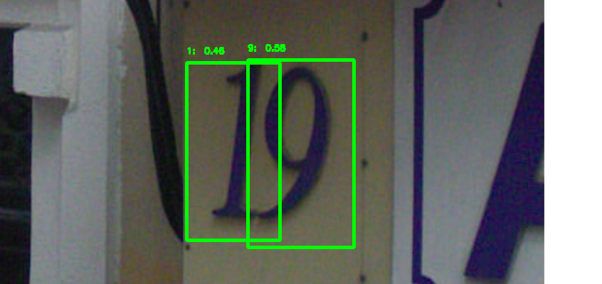
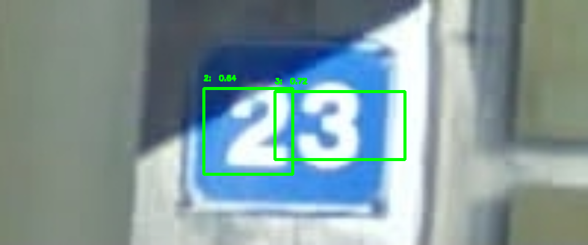
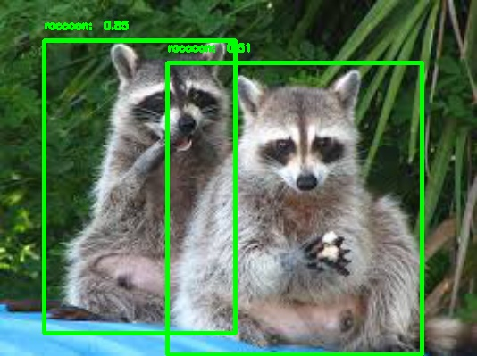

[](https://travis-ci.org/penny4860/Yolo-digit-detector) [](https://codecov.io/gh/penny4860/Yolo-digit-detector)

# SVHN yolo-v2 digit detector

I have implemented a digit detector that applies yolo-v2 to svhn dataset.


## Usage for python code

#### 0. Requirement

* python 3.6
* tensorflow 1.14.0
* keras 2.1.1
* opencv 3.3.0
* Etc.

I recommend that you create and use an anaconda env that is independent of your project. You can create anaconda env for this project by following these simple steps. This process has been verified on Windows 10 and ubuntu 16.04.

```
$ conda create -n yolo python=3.6
$ activate yolo # in linux "source activate yolo"
(yolo) $ pip install -r requirements.txt
(yolo) $ pip install -e .
```

### 1. Digit Detection using pretrained weight file

In this project, the pretrained weight file is stored in [weights.h5](https://drive.google.com/drive/folders/1Lg3eAPC39G9GwVTCH3XzF73Eok-N-dER).

* Example code for predicting a digit region in a natural image is described in [detection_example.ipynb](https://github.com/penny4860/Yolo-digit-detector/blob/master/detection_example.ipynb).
* Training set evaluation (1000-images) is as follows:
  * fscore / precision / recall: 0.799, 0.791, 0.807


### 2. Training from scratch

This project provides a way to train digit detector from scratch. If you follow the command below, you can build a digit detector with just two images.


* First, train all layers through the following command. 
  * `` project/root> python train.py -c configs/from_scratch.json ``
* Next, fine tune only the last layer through the following command. 
  * `` project/root> python train.py -c configs/from_scratch2.json ``
* Finally, evaluate trained digit detector.
  * `` project/root> python evaluate.py -c configs/from_scratch.json -w svhn/weights.h5 ``
  * The evaluation results are output in the following manner.
  	* ``{'fscore': 1.0, 'precision': 1.0, 'recall': 1.0}``
  * The prediction result images are saved in the ``project/detected`` directory.




Now you can add more images to train a digit detector with good generalization performance.

### 3. SVHN dataset in Pascal Voc annotation format

In this project, I use [pascal voc format](http://host.robots.ox.ac.uk/pascal/VOC/) as annotation information to train object detector.
An annotation file of this format can be downloaded from [svhn-voc-annotation-format](https://github.com/penny4860/svhn-voc-annotation-format).


## Other Results

### 1. Raccoon dataset : https://github.com/experiencor/raccoon_dataset



* pretrained weight file is stored at [raccoon](https://drive.google.com/drive/folders/17Co0b5YDNVlWVfuTqygRY_U2qg8FwGmy)
* training set evaluation (160-images)
	* fscore / precision / recall: 0.937, 0.963, 0.913
* test set evaluation (40-images)
	* fscore / precision / recall: 0.631, 0.75, 0.545


## Copyright

* See [LICENSE](LICENSE) for details.
* This project started at [basic-yolo-keras](https://github.com/experiencor/basic-yolo-keras). I refactored the source code structure of [basic-yolo-keras](https://github.com/experiencor/basic-yolo-keras) and added the CI test. I also applied the SVHN dataset to implement the digit detector. Thanks to the [Huynh Ngoc Anh](https://github.com/experiencor) for providing a good project as open source.

## See Also

If you are interested in advanced digit detection algorithm, please refer to the following projects. The following projects can be more stable training than the algorithm of this project.

* https://github.com/penny4860/tf2-eager-yolo3
	* yolo3 detector including digit detection.

* https://github.com/penny4860/retinanet-digit-detector
	* retinanet digit detector.

